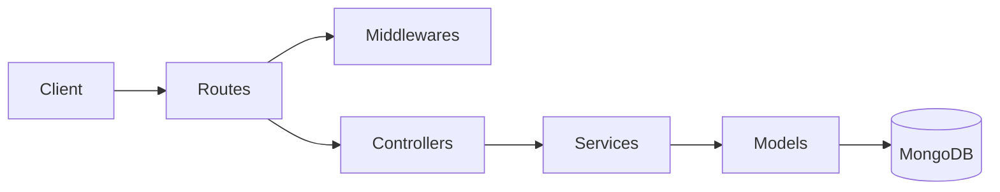
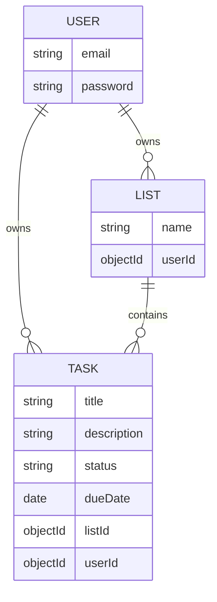
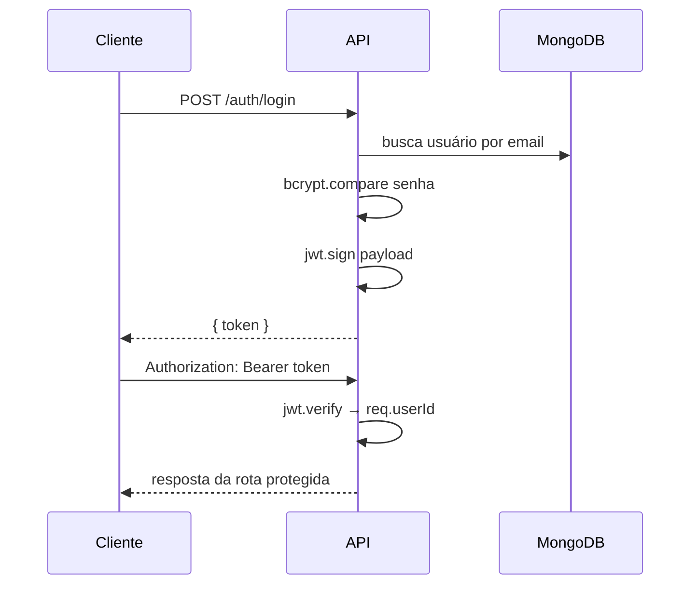

# Task Management API

API REST de gerenciamento de tarefas construída com **Node.js**, **Express** e **TypeScript**, utilizando **MongoDB** como banco de dados e autenticação via **JWT**.

## Tecnologias

- **Runtime:** Node.js 18+
- **Framework:** Express.js
- **Linguagem:** TypeScript
- **Banco de dados:** MongoDB com Mongoose
- **Autenticação:** JSON Web Token (JWT) + bcrypt
- **Validação:** Zod
- **Testes:** Jest + Supertest + mongodb-memory-server

## Funcionalidades

- Registro e login de usuários com JWT
- Criação e listagem de listas de tarefas
- CRUD completo de tarefas (criar, listar, atualizar, remover)
- Vínculo de tarefas a listas
- Filtros na listagem por status, lista e data de vencimento
- Isolamento de dados por usuário — cada usuário acessa apenas os seus recursos
- 8 testes de integração cobrindo fluxos de sucesso e erro

## Arquitetura

```
src/
├── config/         # conexão com o banco
├── controllers/    # handlers HTTP (recebem req/res, chamam services)
├── middlewares/    # autenticação JWT e error handler global
├── models/         # schemas Mongoose (User, List, Task)
├── routes/         # definição de rotas
├── services/       # regras de negócio e acesso ao banco
├── tests/          # testes de integração
└── utils/          # validators (Zod) e geração de token
```



## Como rodar localmente

**Pré-requisitos:** Node.js 18+ e MongoDB (local ou Atlas)

```bash
git clone https://github.com/reczin/task-management-api.git
cd task-management-api
npm install
cp .env.example .env
```

Edite `.env`:

```env
MONGO_URI=mongodb://localhost:27017/taskmanagement
JWT_SECRET=sua_chave_secreta
PORT=3000
```

```bash
npm run dev
```

A API estará disponível em `http://localhost:3000`.

## Testes

Os testes usam **MongoDB em memória** — não é necessário ter o MongoDB instalado para rodá-los.

```bash
npm test
```

| # | Cenário | Resultado esperado |
|---|---------|-------------------|
| 1 | Registro com dados válidos | `201` + `{ "token" }` |
| 2 | Email já cadastrado | `409` |
| 3 | Login com credenciais corretas | `200` + `{ "token" }` |
| 4 | Login com senha errada | `401` |
| 5 | Listar tarefas sem token | `401` |
| 6 | Criar tarefa vinculada a uma lista | `201` + tarefa |
| 7 | Listar tarefas do usuário autenticado | `200` + array |
| 8 | Atualizar campos de uma tarefa | `200` + tarefa atualizada |

## Endpoints

### Autenticação

| Método | Rota | Body | Resposta |
|--------|------|------|----------|
| POST | `/auth/register` | `email`, `password` (mín. 6 chars) | `201` + `{ token }` |
| POST | `/auth/login` | `email`, `password` | `200` + `{ token }` |

### Listas — requer `Authorization: Bearer <token>`

| Método | Rota | Body | Resposta |
|--------|------|------|----------|
| POST | `/lists` | `name` | `201` + lista |
| GET | `/lists` | — | `200` + array |

### Tarefas — requer `Authorization: Bearer <token>`

| Método | Rota | Body / Query | Resposta |
|--------|------|--------------|----------|
| POST | `/tasks` | `title`, `listId`, opcionais: `description`, `status`, `dueDate` | `201` + tarefa |
| GET | `/tasks` | Query: `?listId=`, `?status=`, `?dueDate=` | `200` + array |
| PUT | `/tasks/:id` | Campos a atualizar (pelo menos um) | `200` + tarefa |
| DELETE | `/tasks/:id` | — | `204` |

**Status válidos:** `pendente` \| `em andamento` \| `concluída`

**Filtros combinados:**
```
GET /tasks?status=pendente
GET /tasks?listId=<id>&status=em andamento
GET /tasks?dueDate=2026-12-31   # tarefas com vencimento até essa data
```

## Diagramas

### Modelo ER



### Fluxo de autenticação


