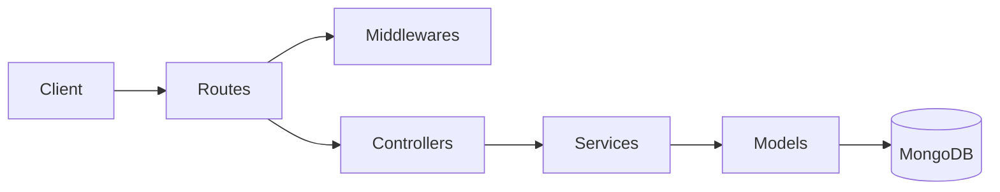
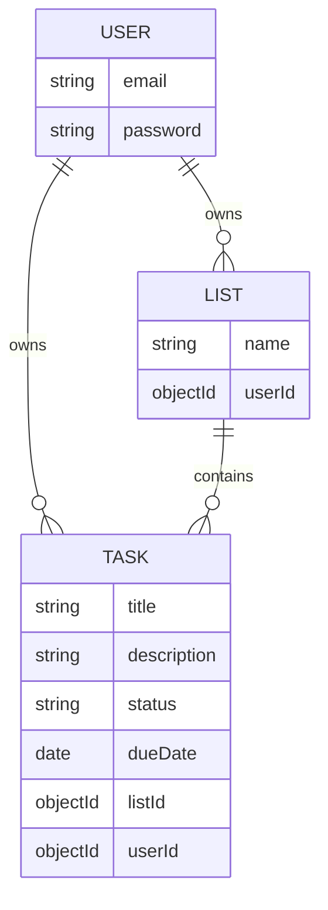
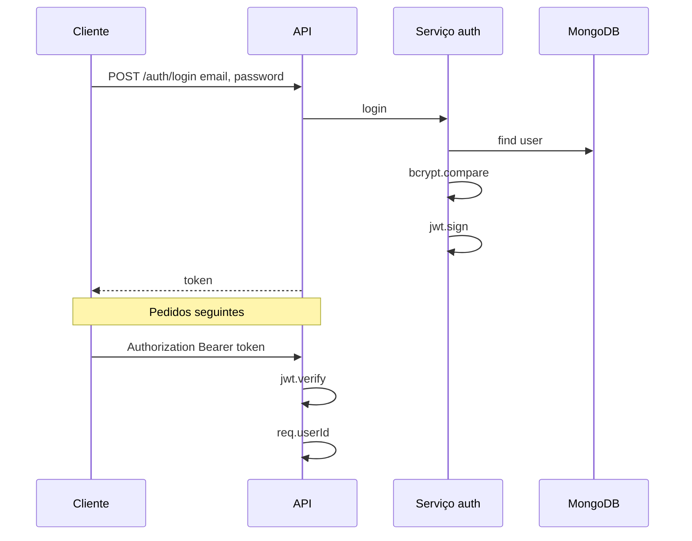

# BextTeste API

API REST para gestão de listas e tarefas, com autenticação JWT e MongoDB.

## Pré-requisitos

- Node.js 18 ou superior
- MongoDB em execução (local ou URI de acesso)

## Configuração

1. Clone o repositório e entre na pasta do projeto.
2. Instale dependências:

```bash
npm install
```

3. Copie o ficheiro de ambiente e ajuste valores:

```bash
copy .env.example .env
```

Edite `.env`:

- `MONGO_URI` — base de dados principal (necessária para `npm run dev` / `start`)
- `JWT_SECRET` — chave usada a assinar tokens (obrigatória em produção; nos testes define-se um fallback se faltar)
- `PORT` — opcional (padrão 3000)

A variável `MONGO_URI_TEST` no `.env.example` é **opcional**; a suíte `npm test` usa **Mongo em memória** e não a precisa, salvo se alterares o `setup` para apontar a uma instância real.

## Executar

Desenvolvimento (recarrega ao guardar):

```bash
npm run dev
```

Compilar e correr em modo produção:

```bash
npm run build
npm start
```

## Testes automatizados

Os testes usam **Jest** e **Supertest** contra a mesma aplicação Express (sem levantar servidor em porta). A base de dados de teste é um **MongoDB em memória** (`mongodb-memory-server`), portanto **não é obrigatório** ter o Mongo a correr no sistema para `npm test` — a primeira execução pode demorar um pouco a descarregar o binário do Mongo.

**Com correr os testes**

```bash
npm test
```

**Comportamento esperado:** deves ver as suites `auth` e `tasks` a passarem, por exemplo `8 passed` no total, e o comando termina sem ficar pendurado (open handles). Se precisares de testes ainda mais verbosos: `npx jest --runInBand --verbose`.

| Ficheiro | Tipo (enunciado) | O que cobre |
|----------|------------------|------------|
| `src/tests/auth.test.ts` | Integração (HTTP) | Registo com token (sucesso), email duplicado (erro), login (sucesso), password errada (erro) |
| `src/tests/tasks.test.ts` | Integração (HTTP) | `GET /tasks` sem token 401, criar tarefa com lista, listar tarefas, atualizar tarefa |

A configuração global está em `src/tests/setup.ts` (início/paragem do Mongo em memória, limpeza entre testes) e `jest.config.js` (`--runInBand` evita corridas no mesmo processo). Os testes cumprem o mínimo de **6** casos, com **fluxos de sucesso e de erro** nos fluxos principais.

### Casos de teste detalhados

| # | Cenário | Método + Rota | Input | Output esperado |
|---|---------|---------------|-------|-----------------|
| 1 | Registo com dados válidos | `POST /auth/register` | `{ "email": "a@a.com", "password": "secret12" }` | `201` — `{ "token": "<JWT>" }` |
| 2 | Email já cadastrado | `POST /auth/register` | Mesmo email de um registo anterior | `409` — `{ "error": "Email já cadastrado" }` |
| 3 | Login com credenciais corretas | `POST /auth/login` | `{ "email": "b@a.com", "password": "secret12" }` | `200` — `{ "token": "<JWT>" }` |
| 4 | Login com senha errada | `POST /auth/login` | Senha incorreta para email existente | `401` — `{ "error": "Credenciais inválidas" }` |
| 5 | Listar tarefas sem token | `GET /tasks` | Sem header `Authorization` | `401` — `{ "error": "Token não fornecido" }` |
| 6 | Criar tarefa vinculada a lista válida | `POST /tasks` | `{ "title": "...", "listId": "<id>" }` com token válido | `201` — documento da tarefa criada |
| 7 | Listar tarefas do usuário autenticado | `GET /tasks` | Header `Authorization: Bearer <token>` | `200` — array com tarefas do usuário (isolado por `userId`) |
| 8 | Atualizar campos de uma tarefa | `PUT /tasks/:id` | `{ "title": "Novo", "status": "em andamento" }` | `200` — tarefa com os campos atualizados |

> **Aplicação em desenvolvimento vs testes:** `npm run dev` continua a precisar de `MONGO_URI` no `.env` apontando para o teu Mongo (local ou Atlas). Só a suite de testes usa a base em memória.

## Rotas

Todas as respostas de erro têm o formato `{ "error": "..." }` ou, em erros de validação, `{ "error": { "fieldErrors": { ... } } }`.

Valores válidos de `status` para tarefas: `pendente` | `em andamento` | `concluída`.

### URL base

| Ambiente | Exemplo |
|----------|---------|
| Local | `http://localhost:3000` |
| Produção | `https://seu-dominio.com` (HTTPS obrigatório) |

### Autenticação — sem `Authorization`

| Método | Caminho | Body (JSON) | Respostas |
|--------|---------|-------------|-----------|
| POST | `/auth/register` | `email` (email válido), `password` (mín. 6 chars) | `201` + `{ "token" }` · `400` validação · `409` email duplicado |
| POST | `/auth/login` | `email`, `password` | `200` + `{ "token" }` · `400` validação · `401` credenciais inválidas |

O token retornado deve ser enviado em todas as rotas protegidas como header `Authorization: Bearer <token>`.

### Listas — requer `Authorization: Bearer <token>`

| Método | Caminho | Body (JSON) | Respostas |
|--------|---------|-------------|-----------|
| POST | `/lists` | `name` (string, não vazio) | `201` + documento da lista (`_id`, `name`, `userId`) · `400` · `401` |
| GET | `/lists` | — | `200` + array de listas do utilizador · `401` |

### Tarefas — requer `Authorization: Bearer <token>`

| Método | Caminho | Body / Query | Respostas |
|--------|---------|--------------|-----------|
| POST | `/tasks` | Body: `title` (obrigatório), `listId` (id de lista **sua**), opcionais: `description`, `status`, `dueDate` | `201` + tarefa · `400` validação ou lista não encontrada · `401` |
| GET | `/tasks` | Query opcionais: `listId`, `status`, `dueDate` | `200` + array · `400` · `401` |
| PUT | `/tasks/:id` | Body: um ou mais campos (`title`, `description`, `listId`, `status`, `dueDate` ou `null` para limpar) | `200` + tarefa atualizada · `400` · `401` · `404` |
| DELETE | `/tasks/:id` | — | `204` sem corpo · `401` · `404` |

**Filtros disponíveis no `GET /tasks`:**

```
GET /tasks?listId=<id>                        filtra por lista
GET /tasks?status=pendente                    filtra por status
GET /tasks?dueDate=2026-12-31                 tarefas com vencimento até essa data
GET /tasks?listId=<id>&status=em andamento    filtros combinados
```

## Exemplos de uso manual

### PowerShell

```powershell
$base = "http://localhost:3000"

# Registo e token
$r = Invoke-RestMethod -Uri "$base/auth/register" -Method Post -ContentType "application/json" -Body '{"email":"joao@mail.com","password":"123456"}'
# Se o email já existir (409), usa login:
# $r = Invoke-RestMethod -Uri "$base/auth/login" -Method Post -ContentType "application/json" -Body '{"email":"joao@mail.com","password":"123456"}'
$token = $r.token
$h = @{ Authorization = "Bearer $token" }

# Criar lista e guardar id
$lista = Invoke-RestMethod -Uri "$base/lists" -Method Post -Headers $h -ContentType "application/json" -Body '{"name":"Trabalho"}'
$listId = $lista._id

# Criar tarefa
$criar = Invoke-RestMethod -Uri "$base/tasks" -Method Post -Headers $h -ContentType "application/json" -Body (@{
  title = "Revisar API"; description = "CRUD e testes"; listId = $listId; status = "pendente"; dueDate = "2026-12-31"
} | ConvertTo-Json)
$taskId = $criar._id

# Listar e filtrar
Invoke-RestMethod -Uri "$base/tasks" -Method Get -Headers $h
Invoke-RestMethod -Uri "$base/tasks?listId=$listId" -Method Get -Headers $h
Invoke-RestMethod -Uri "$base/tasks?status=pendente" -Method Get -Headers $h
Invoke-RestMethod -Uri "$base/tasks?dueDate=2026-12-31" -Method Get -Headers $h

# Atualizar
Invoke-RestMethod -Uri "$base/tasks/$taskId" -Method Put -Headers $h -ContentType "application/json" -Body (@{
  title = "Revisado"; status = "em andamento"
} | ConvertTo-Json)

# Remover
Invoke-RestMethod -Uri "$base/tasks/$taskId" -Method Delete -Headers $h

# Testar 401 (sem token)
try { Invoke-RestMethod -Uri "$base/tasks" -Method Get } catch { $_.Exception.Response.StatusCode }
```

### CMD + curl

```cmd
set BASE=http://localhost:3000

curl -s -X POST %BASE%/auth/register -H "Content-Type: application/json" -d "{\"email\":\"joao@mail.com\",\"password\":\"123456\"}"
curl -s -X POST %BASE%/auth/login    -H "Content-Type: application/json" -d "{\"email\":\"joao@mail.com\",\"password\":\"123456\"}"

curl -s -X POST %BASE%/lists -H "Authorization: Bearer TEU_TOKEN" -H "Content-Type: application/json" -d "{\"name\":\"Trabalho\"}"
curl -s        %BASE%/lists  -H "Authorization: Bearer TEU_TOKEN"

curl -s -X POST %BASE%/tasks -H "Authorization: Bearer TEU_TOKEN" -H "Content-Type: application/json" -d "{\"title\":\"Tarefa 1\",\"listId\":\"ID_LISTA\"}"
curl -s        "%BASE%/tasks?status=pendente" -H "Authorization: Bearer TEU_TOKEN"
curl -s -X PUT    %BASE%/tasks/ID_TAREFA -H "Authorization: Bearer TEU_TOKEN" -H "Content-Type: application/json" -d "{\"title\":\"Novo\"}"
curl -s -X DELETE %BASE%/tasks/ID_TAREFA -H "Authorization: Bearer TEU_TOKEN"
```

---

## Notas para produção

- **HTTPS obrigatório** — o token trafega em claro em `http`; em rede aberta isso expõe credenciais.
- **Variáveis de ambiente** no servidor de alojamento (Railway, Render, VPS, etc.):
  - `MONGO_URI` — string SRV do Atlas ou URI interna, com usuário/senha fortes.
  - `JWT_SECRET` — string longa e aleatória, nunca o valor de exemplo.
  - `PORT` — muitas plataformas injetam automaticamente; a aplicação já respeita `process.env.PORT`.
- **CORS** — a API não configura CORS por padrão; se um browser em outro domínio precisar chamar a API, será necessário adicionar o pacote `cors` ao servidor.
- **Testes automáticos** (`npm test`) usam Mongo em memória e não dependem de URL de produção; para validar a API em produção, usa Postman/Insomnia/curl com a base HTTPS.

---

## Documentação visual

### Arquitetura (camadas)



### Modelo ER (coleções)



### Fluxo de autenticação



## Feedback sobre o desenvolvimento

A estrutura em camadas (rotas → controladores → serviços → modelos) foi a parte mais natural de montar, já que facilita bastante tanto a leitura do código quanto a escrita dos testes — cada camada tem uma responsabilidade clara e isso reflete diretamente em como os testes ficam organizados. A parte de autenticação com JWT também correu sem grandes surpresas; o principal cuidado foi garantir o isolamento por `userId` em todas as operações, evitando que um usuário consiga acessar ou modificar dados de outro mesmo conhecendo os IDs.

O ponto que demandou mais atenção foi a validação de entrada com Zod combinada com o tratamento de erros nos controladores: encontrar o equilíbrio entre mensagens de erro úteis e não vazar informação sensível (como distinguir "email não existe" de "senha errada") foi uma decisão que precisou de revisão. O setup de testes com MongoDB em memória também levou um tempo até ficar estável, especialmente para garantir limpeza de estado entre casos sem deixar handles abertos no Jest.

Se fosse evoluir o projeto, adicionaria paginação nas listagens, um campo de prioridade nas tarefas e, na parte de autenticação, refresh tokens para não depender de um único token de longa duração. Também consideraria adicionar índices compostos no MongoDB para as queries de filtragem por `userId` + `status` + `dueDate`, que são os acessos mais frequentes.
